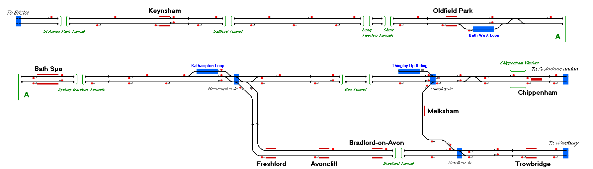

# Bath Spa Area
The lines in the Bath Spa Area, including the Melksham Chord.

## Current Status

| Stage         | Status        |
| ------------- |:-------------:|
| Track Plan     | :heavy_check_mark: |
| Signalling      | :heavy_check_mark:      |
| Naming | :heavy_check_mark:      |
| Speed Limits | :heavy_check_mark: |
| Distances | :heavy_check_mark: |
| Timetable | :heavy_check_mark: |
| Documentation | :heavy_check_mark: |

## Data Sources

- [RealTimeTrains](https://www.realtimetrains.co.uk/)
- [Traksy](https://traksy.uk/live)
- [OpenRailwayMap](https://www.openrailwaymap.org/)
- [NR Sectional Appendix](https://www.networkrail.co.uk/industry-and-commercial/information-for-operators/national-electronic-sectional-appendix/)
